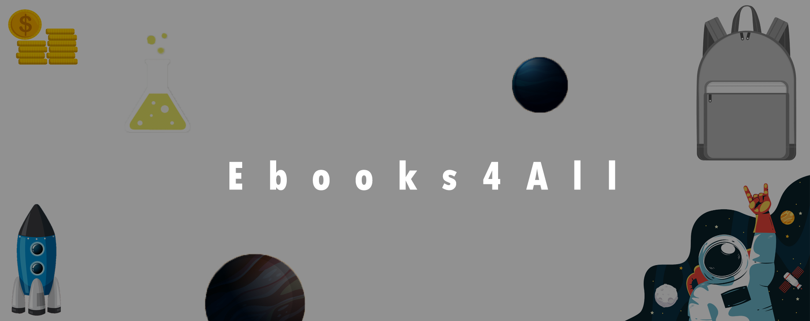

# Ebooks4All

## Objective
We aim to provide a digital curation of learning resources in the form of an interactive mobile application by leveraging already existing Free South African Primary and High School Textbooks like Mind the Gap. This means providing a gamification experience and improving accessibility of these learning resources by providing interactive study guides and tests, self/automatic homework evaluation, video and cartoon based tutorials/lessons. The goal is to have the application adopted in South African schools that are short of textbooks.

## Key Results: 2020
- Curate 100% of Grade 1 [english](https://za.ixl.com/standards/ela/grade-1) and [math](https://za.ixl.com/standards/maths/grade-1) lessons and tests into a cross-platform Mobile/Tablet application. 
- Provide first public release for use by grade 1 learners by the end of the year (1st December).
- We have a working Mobile/Tablet version on Google Play and Apple store.
- At most 20% of the features should require access to the internet. 
- ToDo: Research schools that are shot of textbooks, create a list and target adoption in those schools by mid-2021. 

# Contributors needed:
- Teachers.
- Graphic Designers.
- UX/UI Designers.
- Developers.

# Core Skills Developed

While working on this project you will receive full credits for the work you have done and can add it to your CV. Here is a list of some of the skills you should expect to gain by contributing (It is up to you to set your learning OKRs).
- Code Review.
-    Accountability.
-    Open Source Contributions.
-    Working in Teams.
-    Remote Working and collaboration with people from across the world.
-    Planning and Time Management.
-    Improve your Design, Writing, and Software Development Skills.

# Principles
- The primary measure of progress is a working software. Do not get caught up in the paralyzes of analyses, get your work in and let's iterate on it through continuous feedback.
- Communicate obsessively, always strive to be clear and always ask for clarity.
